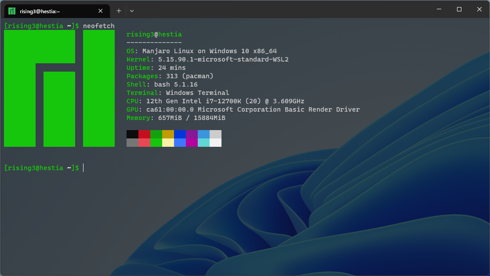

# manjaro-wsl2

Manjaro on WSL2 (Windows 10 FCU or later) based on [wsldl](https://github.com/yuk7/wsldl).



## Overview

A very simply Manjaro on wsl2 using wsldl.

* Using the [manjarolinux/base:latest](https://hub.docker.com/r/manjarolinux/base) images
* [wslutilities](https://github.com/wslutilities/wslu) installed
* Create a new user and set the user as default
* Enable systemd for WSL version 0.67.6 and higher

## Requirements

* For x64 systems: Version 1903 or higher, with Build 18362 or higher.
* Builds lower than 18362 do not support WSL 2.

## How to install

* Make sure all the steps mentioned under "Requirements" are completed.
* [Download](https://github.com/rising3/manjaro-wsl2/releases/latest) installer zip
* Extract all files in zip file to same directory
* Set version 2 as default. Note that this step is required only for manual installation.
  ```dos
  wsl --set-default-version 2
  ```
* Run Manjaro.exe to extract rootfs and register to WSL

**Note:**
Exe filename is using the instance name to register. If you rename it you can register with a diffrent name and have multiple installs.

## How to use installed instance
* [exe usage](https://github.com/yuk7/wsldl#exe-usage)

## How to build from source

### prerequisites

Docker, tar, zip, unzip, bsdtar, make, git(gh) need to be installed.

```dos
gh repo clone rising3/manjaro-wsl2
cd manjaro-wsl2
make
```
Run the command below to clean.
```dos
make clean
```

## License

[MIT License](LICENSE)

## Referred to:

* [Advanced settings configuration in WSL](https://learn.microsoft.com/en-us/windows/wsl/wsl-config)
* [Import any Linux distribution to use with WSL](https://learn.microsoft.com/en-us/windows/wsl/use-custom-distro)
* [Creating a Custom Linux Distribution for WSL](https://learn.microsoft.com/en-us/windows/wsl/build-custom-distro)
* [Advanced WSL launcher / installer](https://github.com/yuk7/wsldl)
* [Manjaro for WSL2 using wsldl](https://github.com/sileshn/ManjaroWSL2)
